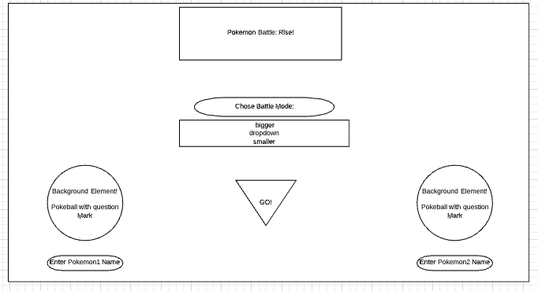
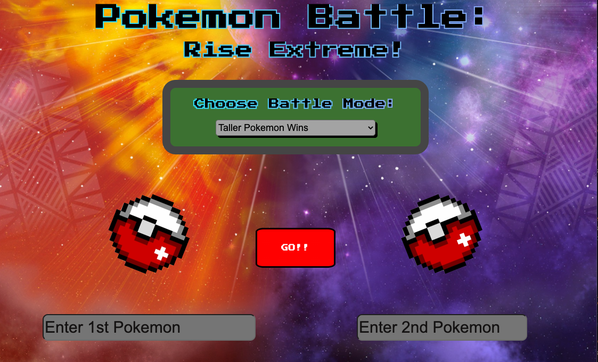
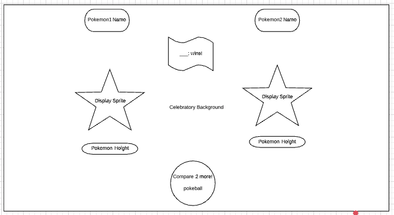
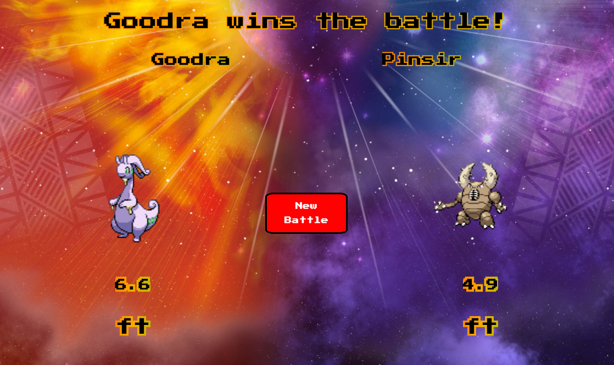

# Pokemon Battle: Rise! Project v1

#### This is a made up Pokemon game using mostly  JavaScript. Pokemon information is from [PokeAPI](https://pokeapi.co/)

### Download it [HERE](https://git.generalassemb.ly/crossronald/pokemon-ga-project1/archive/master.zip)

## I used Lucid Chart to create a wireframe for the landing page:

## Here's the final working result:

## I used Lucid Chart to create a wireframe for the transition page:

## Here's the final working result:

## How's the code?
This is my first forray into creating an app somewhat on my own. Enjoy at your own risk haha.

## "Your Own?"
I had the help of some instructional advisors! Proud to have it!

## User Stories:
* User should be able to enter the names of two Pokemon, press the "GO" button and see animations of their selected Pokemon's sprites.

* User should be able to see the height values of selected Pokemon and see an animation declaring the winner.

* User should hear battle music after clicking the "GO" button.

* User should be able to reset the game with the "New Battle" Button.

## Future Enhancements:
* Cleaner Sprite Animations for Taller/Smaller Battles

* Add Transition Between Landing Page and Battle Page

* Add Animations for pokemon to "attack"

*Add Pokemon sprite noises indicating an attack

## Technologies:
* HTML
* CSS
* Vanilla JavaScript
* JQuery
 

## Getting Started:
Click [HERE](https://crossronald.github.io/pokemon-ga-project1/) to open in desktop.
